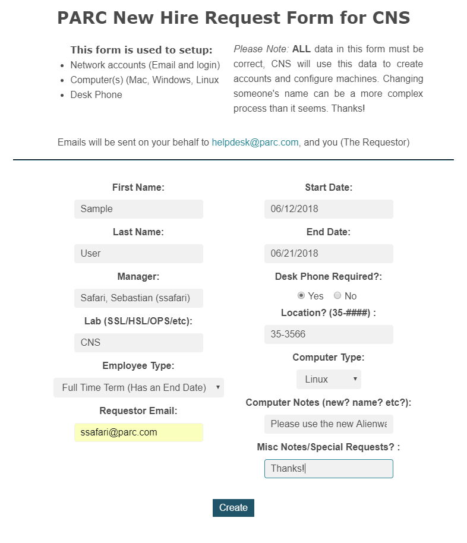
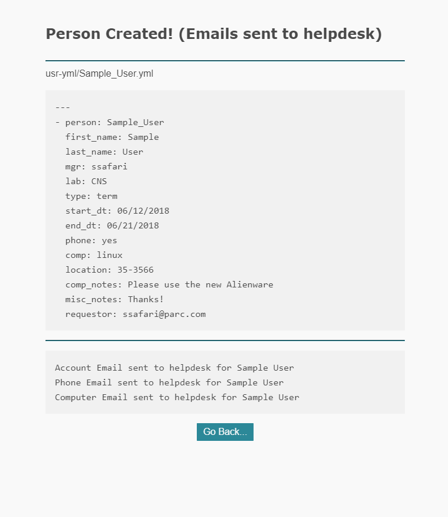

# newhire-request

Form to start the IT processes for creating an account, configuring a machine, setting up a phone, etc.

Current project is in Docker, with files in src/, templates/, & bin/ directory.

When submitting the form, a YAML file gets output in the usr-yml/ directory.

Emails are sent out to helpdesk, one for each item needed

#### TODO: 
- copy this yml file to a seperate server, maybe have an rysnc job?
    - so it can be imported to PeopleDB after reviewing

> You must have docker and sudo priviliges to run this

### Usage: 
- Linux:
    -     make
- Windows:
    -     Make.bat

## Yaml contents

    ---
    - person: Sample_User
      first_name: Sample
      last_name: User
      mgr: ssafari
      lab: IT
      type: term
      start_dt: 06/12/2018
      end_dt: 06/21/2018
      phone: yes
      comp: linux
      location: building 2
      comp_notes: Please use the new Alienware
      misc_notes: Thanks!
      requestor: ssafari@ssebs.com

### Site & Submit output:

This image may be slightly out of date...

